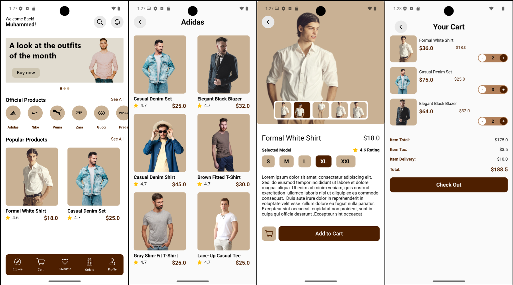

# 🛒 Fashion Home

A modern **Jetpack Compose**-only E-commerce app powered by **Firebase Realtime Database**.  
Users can browse products, view details, and manage their cart in a clean and reactive UI.

---

## ✨ Features
- 📱 100% Jetpack Compose UI — no XML layouts.
- 🔥 Realtime updates from Firebase Realtime Database.
- 🛍️ Add products to cart with quantity management.
- 🎨 Smooth UI with Coil & Glide image loading.
- 📚 Product list and detail pages.
- 🚀 Optimized state handling with LiveData & Compose State.

---

## 🛠️ Built With
| Library | Purpose |
|:-------|:--------|
| [Jetpack Compose](https://developer.android.com/jetpack/compose) | Modern declarative UI toolkit |
| [Firebase Realtime Database](https://firebase.google.com/products/realtime-database) | Backend for live product data |
| [Coil](https://github.com/coil-kt/coil) | Loading images inside Compose |
| [Glide](https://github.com/bumptech/glide) | Image loading for non-Compose views |
| [Accompanist Pager](https://google.github.io/accompanist/pager/) | Horizontal product swiping |
| [Gson](https://github.com/google/gson) | JSON parsing |
| [ConstraintLayout for Compose](https://developer.android.com/jetpack/compose/layouts/constraintlayout) | Complex layouts inside Compose |
| [Material Components](https://m3.material.io/) | Material Design UI |

---

## 📸 Screenshots


---

## 🚀 Getting Started

### Prerequisites
- Android Studio Iguana (or newer)
- Firebase project setup (Realtime Database enabled)

### Installation

1. **Clone the repository**:
   ```bash
   git clone https://github.com/your-username/ComposeCommerce.git
   cd ComposeCommerce
   ```

2. **Connect to Firebase**:
   - Add your `google-services.json` file to `/app` directory.
   - Enable **Realtime Database** from the Firebase Console.

3. **Run the app**:
   - Open in Android Studio.
   - Click "Run".

---

## 🔥 Dependencies
```gradle
implementation("io.coil-kt:coil-compose:2.7.0")
implementation("com.google.accompanist:accompanist-pager:0.36.0")
implementation("com.google.accompanist:accompanist-pager-indicators:0.36.0")
implementation("androidx.lifecycle:lifecycle-runtime-ktx:2.8.7")
implementation("androidx.compose.runtime:runtime-livedata:1.7.8")
implementation("com.github.bumptech.glide:glide:4.13.0")
implementation("com.google.code.gson:gson:2.13.0")
implementation("androidx.constraintlayout:constraintlayout-compose:1.1.1")
implementation("androidx.compose.foundation:foundation:1.7.8")
implementation("androidx.compose.ui:ui-tooling:1.7.8")
implementation("com.google.android.material:material:1.12.0")
```
---

## 📬 Contact
- **Muhammed Amin** – [mohamed.amin.2290@gmail.com](mailto:mohamed.amin.2290@gmail.com)
- GitHub: [muhamedamin308](https://github.com/muhamedamin308)

---

# 📢 Notes
- This app is **UI only**, no backend authentication yet.
- Full Cart Management handled via a lightweight TinyDB wrapper locally.
- Realtime database used only for live product data fetching.